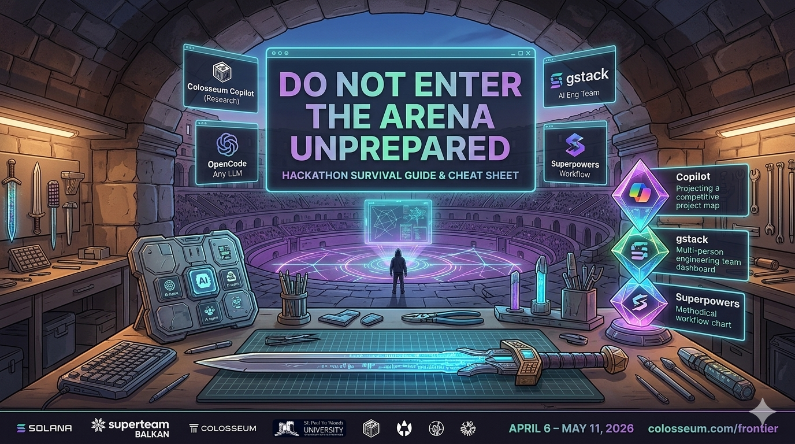

# 🏛️ Colosseum Hackathon – Participant Cheat Sheet

<p align="center">
  
</p>

> **Frontier Hackathon · April 6 – May 11, 2026**
> Your all-in-one reference for the competition, research tools, and AI coding agents.

---

## Table of Contents

1. [The Competition](#-the-competition)
2. [Colosseum Copilot — Research Tool](#-colosseum-copilot--research-tool)
3. [OpenCode — AI Coding Agent](#-opencode--ai-coding-agent)
4. [gstack — AI Engineering Team in a Box](#-gstack--ai-engineering-team-in-a-box)
5. [Superpowers — Agentic Workflow System](#-superpowers--agentic-workflow-system)
6. [Tool Comparison at a Glance](#-tool-comparison-at-a-glance)
7. [Survival Tips](#-survival-tips)

---

## 🏆 The Competition

### Colosseum Frontier Hackathon

| | |
|---|---|
| **Dates** | April 6 – May 11, 2026 (35 days) |
| **Format** | 100% online, global |
| **Register** | [arena.colosseum.org/register](https://arena.colosseum.org/register) |
| **Full Info** | [colosseum.com/frontier](https://colosseum.com/frontier) |

Colosseum runs twice-yearly hackathons paired with a venture accelerator. Past events (Renaissance, Radar, Breakout, Cypherpunk) have produced projects that raised **$700M+** in follow-on funding — Stepn, Tensor, Drift, and Marinade all started here.

### Typical Track Structure

Based on previous Colosseum hackathons, expect these competition tracks (Frontier-specific tracks TBA on the official site):

| Track | What it covers |
|---|---|
| **Consumer Apps** | End-user products: wallets, social, gaming, NFTs |
| **DeFi** | DEXs, lending, perpetuals, yield, structured products |
| **Stablecoins / RWAs** | Payments, real-world asset tokenization |
| **Infrastructure** | Dev tooling, RPCs, indexers, oracles, security |
| **DePIN** | Decentralized physical infrastructure networks |
| **Undefined / Open** | Long-tail ideas that don't fit elsewhere — often most creative |

### Prizes (Typical Structure)

| Award | Amount |
|---|---|
| Grand Champion | ~$30,000 USDC |
| Per-Track Winners (×3–5 per track) | $5,000–$25,000 USDC each |
| University Award | ~$10,000 USDC |
| Public Goods / Open Source | ~$10,000 USDC |

**Accelerator:** Up to 15 teams receive **$250,000 pre-seed** + accelerator admission + VC demo day.

### What Judges Look For

- **Impact** — Does this solve a real problem? Who benefits?
- **Technical execution** — Is it actually built, not just pitched?
- **Originality** — Has this been done before? (Copilot helps you check)
- **Solana-native** — Does it use Solana's strengths (speed, cost, composability)?
- **Team** — Can this team actually ship?

### Key Rules (Always Verify on Official Site)

- Projects must be **primarily built during the hackathon window**
- Teams can be **1–5 people**
- You may use **open-source libraries and prior code** for non-core functionality
- Submit through **arena.colosseum.org** before the deadline
- One submission per team per track

### Eternal — Can't Wait?

If you're already building and don't want to wait for April 6, Colosseum's **Eternal** program is a perpetual 4-week sprint you can start anytime. Offers: $250K pre-seed + accelerator + $25K Eternal Award.

---

## 🔍 Colosseum Copilot — Research Tool

**→ [colosseum.com/copilot](https://colosseum.com/copilot)**

A research skill for Claude Code (and other AI coding assistants) that gives you competitive intelligence before you build. Think of it as your "have I been beaten to this idea?" engine.

### What's Inside

| Dataset | Size |
|---|---|
| Hackathon project submissions | 5,400+ (Renaissance, Radar, Breakout, Cypherpunk) |
| Live crypto ecosystem products | 6,300+ (via The Grid) |
| Curated research sources | 65+ (a16z Crypto, Multicoin, Solana docs, essays) |

### What It Does

- **Semantic search** across all 5,400+ projects — finds similar ideas even if named differently
- **Automatic topic clustering** — AI Agents, DEX, DeFi, Gaming, Payments, DePIN
- **Direct competitor alerts** — instantly surfaces existing projects in your space
- **Trend analysis** — shows which ideas are rising or saturated across hackathons
- **Idea validation** — gives you critical feedback, not cheerleading

### Setup (2 minutes)

```bash
# 1. Get your token at:
#    arena.colosseum.org/copilot

# 2. Install the skill in Claude Code
/install <your-token>

# 3. Start querying
# Example: "Are there existing projects building AI agents for Solana DeFi?"
```

### Use It First

Before writing a single line of code, run your idea through Copilot. The worst outcome at a hackathon is spending 35 days rebuilding something that already exists — or worse, something that already won.

---

## 💻 OpenCode — AI Coding Agent

**→ [opencode.ai](https://opencode.ai)**
**120k ⭐ · 800+ contributors · Open Source**

An open-source AI coding agent that runs in your terminal, desktop app, or IDE. Unlike Claude Code (Anthropic-only), OpenCode connects to **75+ LLM providers** — including Claude, GPT-4, Gemini, and local models. **Both gstack and Superpowers install on top of OpenCode** — so start here.

### Install

```bash
curl -fsSL https://opencode.ai/install | bash
```

Or via package managers:
```bash
# npm
npm install -g opencode-ai

# Homebrew (macOS)
brew install opencode

# Chocolatey (Windows)
choco install opencode
```

### First-Time Setup

```bash
# 1. Connect an AI model
/connect        # Recommends OpenCode Zen for newcomers

# 2. Initialize in your project
/init           # Analyzes project, creates AGENTS.md

# 3. Start building
# Just type in natural language
```

### Key Commands

| Command | What it does |
|---|---|
| `/connect` | Add an LLM provider (Claude, GPT, Gemini, local) |
| `/init` | Analyze project structure, generate AGENTS.md |
| `Tab` | Enter Plan mode — think before acting |
| `/undo` | Undo last change |
| `/redo` | Redo undone change |
| `/share` | Generate shareable session link |

### Standout Features

- **LSP-enabled** — automatically loads language servers so the LLM understands your codebase deeply
- **Multi-session** — run multiple agents simultaneously on the same project
- **Drag-and-drop images** — attach design references directly in terminal
- **Session sharing** — share a `/share` link for debugging or pair-programming
- **Privacy-first** — does not store your code or context data
- **OpenCode Zen** — pre-validated, pre-tested models optimized for coding agents

### Provider Flexibility

Works with: Claude (Anthropic), GPT-4o (OpenAI), Gemini (Google), GitHub Copilot, ChatGPT Plus/Pro, or any of 75+ providers via [models.dev](https://models.dev).

---

## ⚙️ gstack — AI Engineering Team in a Box

**→ [github.com/garrytan/gstack](https://github.com/garrytan/gstack)**
**51k ⭐ · MIT License · Built by Garry Tan (YC President)**

gstack transforms OpenCode/Claude Code into a virtual engineering team: 28 slash-command skills that cover the entire sprint lifecycle — from idea to production PR.

> *"600,000+ lines of production code shipped in 60 days while running YC full-time."* — Garry Tan

### Install (30 seconds)

**Requirements:** OpenCode (or Claude Code), Git, Bun v1.0+

```bash
git clone --single-branch --depth 1 \
  https://github.com/garrytan/gstack.git \
  ~/.claude/skills/gstack \
  && cd ~/.claude/skills/gstack && ./setup
```

Optional project-local install:
```bash
cp -Rf ~/.claude/skills/gstack .claude/skills/gstack \
  && rm -rf .claude/skills/gstack/.git \
  && cd .claude/skills/gstack && ./setup
```

### The Sprint Workflow

```
Think → Plan → Build → Review → Test → Ship → Reflect
```

### Key Commands

#### 🧠 Planning & Strategy
| Command | What it does |
|---|---|
| `/office-hours` | Challenges your idea with 6 forcing questions before you write code |
| `/autoplan` | Runs CEO → design → eng review automatically |
| `/plan-ceo-review` | Scope review: is this the right thing to build? |
| `/plan-eng-review` | Architecture lockdown: data flow, edge cases, test matrix |
| `/plan-design-review` | Design audit: rates 0–10, flags "AI slop" |

#### 🔨 Build & Review
| Command | What it does |
|---|---|
| `/review` | Staff-engineer code audit; auto-fixes obvious issues |
| `/investigate` | Systematic root-cause debugging |
| `/cso` | OWASP Top 10 + STRIDE security audit |

#### 🧪 Testing & QA
| Command | What it does |
|---|---|
| `/qa <url>` | Opens real Chromium, clicks flows, fixes bugs, adds regression tests |
| `/qa-only <url>` | Bug report only, no code changes |
| `/benchmark` | Page load, Core Web Vitals, resource sizes baseline |

#### 🚀 Ship
| Command | What it does |
|---|---|
| `/ship` | Syncs main, runs tests, opens PR |
| `/land-and-deploy` | Merges PR, monitors CI, deploys to prod |
| `/canary` | Post-deploy monitoring for regressions |
| `/document-release` | Updates all docs to match shipped code |

#### 🛡️ Safety
| Command | What it does |
|---|---|
| `/careful` | Warns before `rm -rf`, `DROP TABLE`, force-push |
| `/freeze` | Restricts edits to one directory during debugging |
| `/guard` | `/careful` + `/freeze` combined |

### Hackathon Workflow Example

```
You:   "I want to build an AI agent that auto-rebalances Solana DeFi positions"
You:   /office-hours
→ Reveals actual need: portfolio risk management, not just rebalancing

You:   /autoplan
→ 10-section scope doc + architecture diagrams generated in minutes

Claude: [Writes 2,400 lines across 11 files in ~8 minutes]

You:   /review
→ AUTO-FIXED 2 issues, flags 1 async race condition

You:   /qa https://staging.myapp.com
→ Clicks flows, finds edge case, writes regression test

You:   /ship
→ Tests: 42 → 51 (+9 new). PR created. Docs updated.
```

### Power Features

- **Parallel Sprints** — Run 10–15 sessions simultaneously via Conductor
- **Browser Handoff** — Hit a CAPTCHA? `$B handoff` → you solve it → `$B resume`
- **Multi-AI Review** — `/codex` cross-checks with OpenAI for independent second opinion
- **Headed Browser** — `$B connect` opens YOUR Chrome with live green shimmer = agent is driving

---

## ⚡ Superpowers — Agentic Workflow System

**→ [github.com/obra/superpowers](https://github.com/obra/superpowers)**
**117k ⭐ · MIT License · By Jesse Vincent / Prime Radiant**

A skills framework that stops coding agents from immediately diving into code. Instead, it enforces: brainstorm → plan → build → test → review. Installs on top of OpenCode, Claude Code, Cursor, Codex, or Gemini CLI.

### Install

**OpenCode (recommended — install this first):**
```
Tell OpenCode: "Fetch and follow instructions from
https://raw.githubusercontent.com/obra/superpowers/refs/heads/main/.opencode/INSTALL.md"
```

**Claude Code (official marketplace):**
```bash
/plugin install superpowers@claude-plugins-official
```

**Claude Code (custom marketplace):**
```bash
/plugin marketplace add obra/superpowers-marketplace
/plugin install superpowers@superpowers-marketplace
```

**Cursor:**
```
/add-plugin superpowers
```
Or search "superpowers" in the plugin marketplace.

**Gemini CLI:**
```bash
gemini extensions install https://github.com/obra/superpowers
```

**Update:**
```bash
/plugin update superpowers
```

### The 7-Phase Workflow

| Phase | What Happens |
|---|---|
| **1. Brainstorm** | Agent asks questions, explores alternatives, presents designs for validation |
| **2. Git Worktrees** | Creates isolated branch workspace after design approval |
| **3. Write Plan** | Breaks work into 2–5 minute tasks with exact file paths + verification steps |
| **4. Subagent Execution** | Fresh subagents per task, two-stage review (spec compliance → code quality) |
| **5. TDD** | RED-GREEN-REFACTOR enforced. No tests = task not complete. |
| **6. Code Review** | Validates implementation against the original plan, reports by severity |
| **7. Branch Finish** | Verifies tests pass, handles merge/PR |

### Why Use It

- Skills **trigger automatically** — no slash commands needed
- Prevents the most common agent failure: **jumping to code before understanding**
- Built-in anti-patterns reference keeps tests meaningful
- Parallel agent dispatching for concurrent work streams

### Community

[Discord](https://discord.gg/Jd8Vphy9jq) · [Issues](https://github.com/obra/superpowers/issues)

---

## 📊 Tool Comparison at a Glance

| | Copilot | OpenCode | gstack | Superpowers |
|---|---|---|---|---|
| **Purpose** | Idea research | AI coding agent | AI eng team | Workflow enforcer |
| **Works with** | Claude Code | Any LLM (75+ providers) | OpenCode / Claude Code | OpenCode, Cursor, Codex, Gemini |
| **Stars** | — | 120k ⭐ | 51k ⭐ | 117k ⭐ |
| **Install time** | 2 min | 1 min | 30 sec | 30 sec |
| **Best for** | Pre-build validation | Multi-model flexibility | Structured AI sprints | Disciplined TDD workflow |
| **License** | Colosseum | MIT | MIT | MIT |
| **Free?** | ✅ | ✅ | ✅ | ✅ |

**Recommended combo for this hackathon:**
```
Copilot (validate idea) → OpenCode (base agent) → gstack or Superpowers (install on top)
```

---

## 🧠 Survival Tips

### Before You Write Code
1. **Run your idea through Copilot first.** 5,400+ prior submissions — know what exists.
2. **Use `/office-hours` (gstack)** to stress-test your concept before committing.
3. **Pick one track and own it.** Judges prefer depth over breadth.

### During the Build
4. **TDD from day one.** Both gstack (`/qa`) and Superpowers enforce it — your future self will thank you.
5. **Commit small and often.** Superpowers' worktrees + gstack's `/careful` guard against disaster.
6. **`/review` before every PR.** Catches bugs that would embarrass you in the demo.

### Solana-Specific
7. **Use the Solana Playground** ([beta.solpg.io](https://beta.solpg.io)) for quick Anchor/Solana program prototyping.
8. **Helius, Triton, and QuickNode** all have hackathon-tier RPC plans — apply early, they fill up.
9. **Check [solana.com/developers](https://solana.com/developers)** — Copilot also has Solana docs baked in.

### Final Submission
10. **Demo video is not optional.** Every winning team has a clear 2-minute demo.
11. **Ship something working, not something complete.** Judges run demos. If it crashes, you lose.
12. **Public GitHub repo** with a clean README = instant credibility.

---

## 🔗 Quick Reference Links

| Resource | Link |
|---|---|
| Register for Frontier | [arena.colosseum.org/register](https://arena.colosseum.org/register) |
| Frontier hackathon page | [colosseum.com/frontier](https://colosseum.com/frontier) |
| Colosseum Copilot | [colosseum.com/copilot](https://colosseum.com/copilot) |
| gstack repo | [github.com/garrytan/gstack](https://github.com/garrytan/gstack) |
| Superpowers repo | [github.com/obra/superpowers](https://github.com/obra/superpowers) |
| OpenCode | [opencode.ai](https://opencode.ai) |
| Solana Developer Docs | [solana.com/developers](https://solana.com/developers) |
| Solana Playground | [beta.solpg.io](https://beta.solpg.io) |
| Colosseum Blog | [blog.colosseum.com](https://blog.colosseum.com) |
| How to Win a Colosseum Hackathon | [colosseum.com/hackathon](https://colosseum.com/hackathon) |

---

*Prepared for the Colosseum Frontier Hackathon · March 2026*
*Verify competition details at [colosseum.com/frontier](https://colosseum.com/frontier) — track/prize specifics publish closer to April 6.*